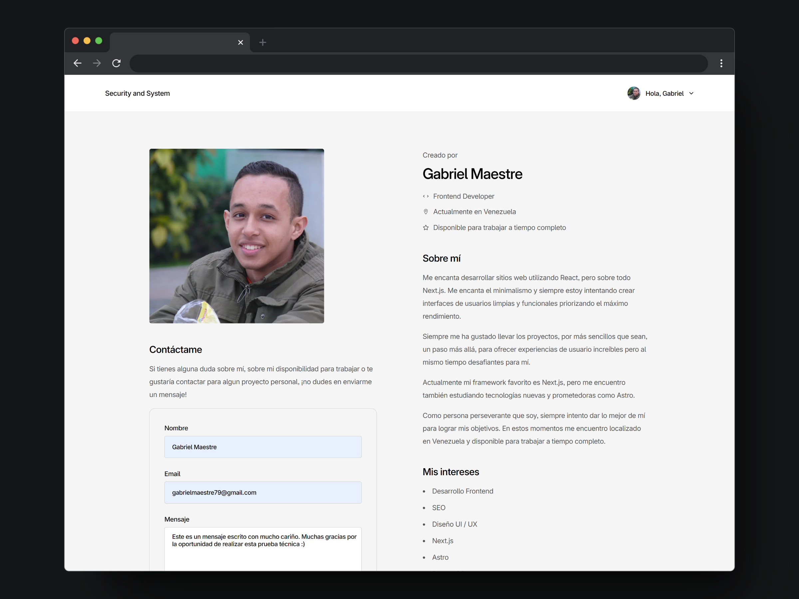

Esta es una prueba técnica para desarrollador frontend para la empresa Security and System.

Puedes ver el proyecto ya desplegado [`aquí`](https://prueba-frontend-security-and-system.vercel.app/)

## Cómo ejecutar el proyecto

1. **Primero, clona el repositorio de github:**

```bash
  git clone https://github.com/kiosao6/prueba-frontend-security-and-system
```

2. **Una vez clonado en tu máquina, abre la terminal integrada e instala las dependencias:**

```bash
  npm install
```

3. **Una vez instaladas las dependencias, puedes correr el proyecto usando el servidor de desarrollo:**

```bash
  npm run dev
```

4. **Para acceder a la aplicación basta con abrir una ventana en el navegador e ir a:**

```bash
  http://localhost:3000
```

Para ver la estructura de la página, ve a  `app/page.tsx`.

Este proyecto utiliza la tipografía Inter descargada [`de su sitio web oficial`](https://rsms.me/inter/). Se decidió utilizar esta versión ya que tiene más legibilidad, más ligaturas y está más optimizada que la versión de Google Fonts.

## Acerca de los Tests

Este proyecto utiliza tests en la versión del Dom utilizando Jest y React Testing Library para asegurarse de que los requisitos de la prueba técnica están correctamente mostrándose en pantalla y que no haya errores.

Puedes ver el archivo completo con los tests en `__tests__/app/Home.tsx`.

Para ejecutar los tests, ve a la terminal integrada y ejecuta el siguiente script:

```bash
  npm test
```

## Requisitos y especificaciones de la prueba

Maquetar una página web que incluya:
- Una cabecera con el nombre del usuario y una imagen de perfil.
- Una sección de "Sobre mí" con una breve descripción del usuario.
- Una lista de intereses del usuario.
- Un formulario de contacto con campos para nombre, email y mensaje.
- Utilizar CSS (sin frameworks como Bootstrap) para estilizar la página. Debe ser responsiva y verse bien en dispositivos móviles y de escritorio.
- Crear la estructura del proyecto con Next.js 14.
- Implementar los componentes necesarios para cada sección de la página (por ejemplo, Header, About, Interests, ContactForm).
- Implementar el formulario de contacto con validación básica y mostrar un mensaje de éxito al enviar (no es necesario manejar envíos reales).

### Extras (Plus):
- Utilizar CSS Modules para el manejo de estilos.
- Agregar animaciones o transiciones suaves para mejorar la experiencia del usuario.
- Incluir tests básicos con Jest o Testing Library.

### Entregables
- Un repositorio de GitHub con el código del proyecto.
- Un archivo README.md que explique cómo instalar y ejecutar el proyecto.


